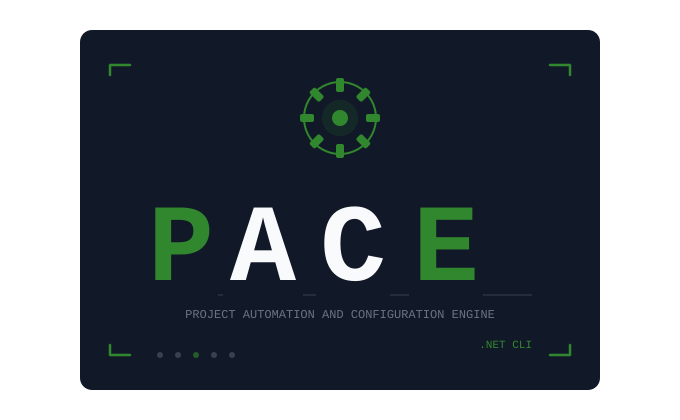

<p align="center">
  
</p>

<h1 align="center"><b>P</b>roject <b>A</b>utomation and <b>C</b>onfiguration <b>E</b>ngine</h1>

<p align="center">
  Manage a whole family of C# .NET repositories from one command line.<br>
  Use it for anything from a single class library to a tree of libraries, sample apps, and MAUI applications.
</p>

<p align="center">
  <a href="https://python.org"></a>
  <a href="https://dotnet.microsoft.com"></a>
  <a href="https://dotnet.microsoft.com/apps/maui"></a>
  <a href="https://pypi.org/project/pace-dotnet/"></a>
  <a href="./LICENSE"></a>
</p>

---

## Contents

- [Why PACE?](#why-pace)
- [Quick start](#quick-start)
- [Commands](#commands)
- [Working with part of your project graph](#working-with-part-of-your-project-graph)
- [Configuration reference](#configuration-reference)
- [Troubleshooting](#troubleshooting)
- [What's in this repository](#whats-in-this-repository)
- [Contributing and development](#contributing-and-development)
- [License](#license)

---

## Why PACE?

When a product is spread across many repositories, routine work gets tedious: cloning every repo, pulling them all, switching branches, and building everything in the right order. PACE does that work for you.

You describe your projects and their dependencies **once** in a small TOML file. After that, a single command acts on every project:

```bash
pace git pull                 # pull every repository in parallel
pace dotnet build -c Release  # build everything, dependencies first
```

PACE is built for:

| Project type | Examples |
|---|---|
| **Class libraries** | Standalone or NuGet-published reusable packages |
| **MAUI applications** | Cross-platform apps with platform images and build assets |
| **Dependency trees** | Libraries that depend on other libraries |
| **Sample applications** | Reference and demo apps that ship alongside a library suite |

It works on these principles:

- **Dependency-aware.** For example, `CoreLib` is always built before `ExtensionLib`, and `ExtensionLib` before `SampleApp`.
- **Scriptable.** It has plain commands and real exit codes, so it works well in shell scripts and CI.
- **Transparent.** Output is clear and readable. Nothing happens silently.
- **Reproducible.** Your workspace is described in a config file that you can keep under version control.

---

## Quick start

### 1. Install the prerequisites

- **Python 3.11 or newer**
- **Git**
- **.NET SDK 9.0.200 or newer.** PACE uses `.slnx` solution files, which need this version. Also install any SDKs or workloads your own projects need, such as MAUI.

### 2. Install PACE

We recommend [pipx](https://pipx.pypa.io/), which installs command-line tools in their own isolated environment. The built-in `pace update` command also uses pipx.

```bash
pipx install pace-dotnet
```

Plain pip works too:

```bash
pip install pace-dotnet
```

Check that it installed correctly:

```bash
pace --version
```

### 3. Describe your workspace

Create a config file, for example `~/.pace/configs/my-workspace.toml`:

```toml
# Folder where PACE clones and looks for your repositories (use a full path)
repodir = "/home/you/repos"

[[projects]]
name = "common-lib"
csproj_path = "src/CommonLib/CommonLib.csproj"
repo_url = "https://github.com/your-org/common-lib"

[[projects]]
name = "feature-module"
csproj_path = "src/FeatureModule/FeatureModule.csproj"
repo_url = "https://github.com/your-org/feature-module"
depends_on = ["common-lib"]
```

PACE clones each repository into `repodir/<repository name>` and looks for its project file at `repodir/<name>/<csproj_path>`. Set each project's `name` to the repository's folder name (the last part of `repo_url`) so the two match. In this example, the first project file lives at `/home/you/repos/common-lib/src/CommonLib/CommonLib.csproj`.

For every available setting, see the [Configuration reference](#configuration-reference).

### 4. Run your first commands

```bash
# Select the config. PACE remembers it, so you only need -C once.
pace -C my-workspace.toml --print-config

# Clone every repository
pace git clone

# Build everything in dependency order
pace dotnet build
```

> [!TIP]
> If you give `-C` a bare file name like `my-workspace.toml`, PACE first looks in the current folder and then in `~/.pace/configs/`. PACE stores the last config you used in `~/.pace/settings.json`.

---

## Commands

Put global options such as `-C`, `--from`, and `--to` **before** the command name.

```text
pace [global options] <command> [command options]
```

### At a glance

| Command | What it does |
|---|---|
| `pace git clone` | Clones every repository that isn't already cloned |
| `pace git pull` | Pulls every repository in parallel |
| `pace git checkout <branch>` | Checks out the same branch in every repository |
| `pace dotnet <args>` | Runs a `dotnet` command (`build`, `test`, `restore`, `pack`, `publish`, …) across all projects |
| `pace clean` | Deletes build outputs and NuGet caches |
| `pace upload <package>` | Uploads an app package (`.ipa`, `.msix`, `.aab`, `.apk`) to a deployment server |
| `pace update` | Upgrades PACE to the latest version (uses pipx) |

Run `pace --help`, or `pace <command> --help`, for full details.

### `pace dotnet`: build, test, pack, and publish

PACE writes a solution file, `PACE.slnx`, inside your `repodir` that contains your selected projects. It then runs `dotnet` against that solution once. MSBuild works out the dependency order and builds projects in parallel where it can.

```bash
pace dotnet build -c Release
pace dotnet test
pace dotnet pack -c Release
pace dotnet build -f net10.0          # only projects that target net10.0

# Print a summary of build warnings, grouped by code and project
pace dotnet -w build
```

Anything after the dotnet subcommand is passed straight to `dotnet`. Don't add your own project or solution path, because PACE supplies `PACE.slnx`.

> [!NOTE]
> Put `-w` / `--summarize-warnings` **before** the dotnet subcommand (`pace dotnet -w build`). If you put it after the subcommand, it is passed through to `dotnet` instead.

### `pace git`: work across all repositories

```bash
pace git clone              # clone anything that's missing
pace git pull               # pull everything
pace git checkout develop   # switch every repo to "develop"
```

Projects that don't have a `repo_url` are skipped.

### `pace clean`: start fresh

```bash
pace clean --dry-run        # preview what would be deleted
pace clean --project        # bin/, obj/, and AppPackages/ in every project
pace clean --cache          # ~/.nuget/packages
pace clean --custom-cache   # the folder set in nuget_cache_path
pace clean                  # all of the above
```

### `pace upload`: send an app build to a deployment server

```bash
pace upload ./MyApp.apk \
  --username alex \
  --app-name MyApp \
  --platform Android \
  --release-type Release \
  --version 1.4.0 \
  --endpoint https://deploy.example.com \
  -n "Fixes login crash"
```

`--platform` must be `iOS`, `Android`, or `Windows`. `--release-type` must be `Debug` or `Release`. Both are case-sensitive. To read the build notes from a file, use `-N <file>`.

### Global options

| Option | Description |
|---|---|
| `-C`, `--config <path>` | Selects a config file. PACE remembers it for next time. |
| `--from <name>` | Includes only this project and the projects that depend on it |
| `--to <name>` | Includes only this project and the projects it depends on |
| `--print-config` | Prints the loaded (and filtered) configuration |
| `--print-config-path` | Prints the path of the active config file |
| `-v`, `--version` | Prints the version and checks for updates |
| `--debug` | Shows full error tracebacks |

---

## Working with part of your project graph

You often only need to work on part of the graph. You can narrow any command to the projects you care about with `--from` and `--to`:

```text
common-lib  ──►  feature-module  ──►  sample-app
```

| Command | Projects included |
|---|---|
| `pace --from feature-module dotnet build` | `feature-module`, `sample-app` (it and everything downstream) |
| `pace --to feature-module dotnet build` | `common-lib`, `feature-module` (it and everything it needs) |
| `pace --from common-lib --to feature-module git pull` | `common-lib`, `feature-module` (the path between them) |

Both ends are included, and names are case-sensitive. To check what a filter selects before running anything, add `--print-config`.

---

## Configuration reference

A full example:

```toml
repodir = "/home/you/repos"                    # where repositories live
nuget_cache_path = "/home/you/nuget-packages"  # optional custom NuGet cache

[[projects]]
name = "common-lib"                     # must match the repository folder name
csproj_path = "src/CommonLib/CommonLib.csproj"
repo_url = "https://github.com/your-org/common-lib"
sln_group = "Libraries"                 # optional folder inside PACE.slnx
depends_on = []

[[projects]]
name = "sample-app"
csproj_path = "src/SampleApp/SampleApp.csproj"
repo_url = "https://github.com/your-org/sample-app"
sln_group = "Samples"
depends_on = ["common-lib"]

[[build-props]]
name = "DevSolution"
datatype = "boolean"                    # boolean, string, or path
default = true
```

### Top-level settings

| Key | Required | Description |
|---|---|---|
| `repodir` | Yes | Folder that contains (or will contain) all of your repositories. PACE creates it if it doesn't exist. You can override it with the `REPODIR` environment variable. |
| `nuget_cache_path` | No | A custom NuGet package cache, cleaned by `pace clean --custom-cache` |

### `[[projects]]`

| Key | Required | Description |
|---|---|---|
| `name` | Yes | Unique project name. It must match the repository's folder name under `repodir`. |
| `csproj_path` | Yes | Path to the `.csproj` file, relative to `repodir/<name>` |
| `repo_url` | No | Git URL used by `pace git`. If you leave it out, the project is skipped by Git commands. |
| `depends_on` | No | Names of projects this one depends on |
| `sln_group` | No | Solution folder to group the project under in `PACE.slnx` |

### `[[build-props]]`

Declares MSBuild properties that you use across your projects. The desktop app uses these to let you set property values when building.

| Key | Description |
|---|---|
| `name` | MSBuild property name |
| `datatype` | `boolean`, `string`, or `path` |
| `default` | Default value |

> [!TIP]
> Use full, absolute paths. `pace` does not expand `~` to your home folder.
> **Windows paths:** use single quotes, as in `'C:\Repos'`, or double each backslash, as in `"C:\\Repos"`.

---

## Troubleshooting

**"No configuration file found"**
PACE doesn't know which config to use yet. Run any command once with `-C path/to/config.toml`.

**A project is missing from the build**
Check that its `.csproj` file exists at `repodir/<name>/<csproj_path>`, and that `name` matches the cloned folder name. Also check whether `--from`/`--to` or `-f <framework>` excluded it. Use `--print-config` to see what was selected.

**Projects outside my `--from`/`--to` range still get built**
This is expected. MSBuild follows the real `<ProjectReference>` entries in your project files, so it still builds anything a selected project references. Keep `depends_on` in sync with your project references.

**`pace update` says pipx isn't found**
Either install [pipx](https://pipx.pypa.io/), or upgrade with `pip install --upgrade pace-dotnet`.

**Unknown or unsupported `dotnet` command**
Make sure your .NET SDK is version 9.0.200 or newer (`dotnet --version`). Older SDKs can't read `.slnx` files.

---

## What's in this repository

| Folder | What it is |
|---|---|
| [`pace/`](./pace) | The `pace` CLI, published on PyPI as [`pace-dotnet`](https://pypi.org/project/pace-dotnet/). **Start here.** |
| [`pacev2/`](./pacev2) | The next-generation CLI (`pacev2`), still in development. It adds parallel Git for any subcommand, live build progress, and JSON output for tools. See its [README](./pacev2/README.md). |
| [`app2/`](./app2) | The PACE desktop app (Tauri + Svelte), built on `pacev2`. See its [README](./app2/README.md). |
| [`app/`](./app) | The original desktop app (Tauri + Svelte) |
| [`scripts/`](./scripts) | Helper scripts for releases and test fixtures |
| [`assets/`](./assets) | Logo and artwork |

---

## Contributing and development

To work on the `pace` CLI:

```bash
cd pace

# Install in editable mode with the dev tools
pip install -e ".[dev]"

pytest              # run the tests
ruff format .       # format the code
ruff check --fix .  # lint and apply safe fixes
pyright             # type check
```

For `pacev2` and the desktop app, follow the development steps in [`pacev2/README.md`](./pacev2/README.md#development) and [`app2/README.md`](./app2/README.md#development).

---

## License

PACE is released under the [MIT License](./LICENSE).
