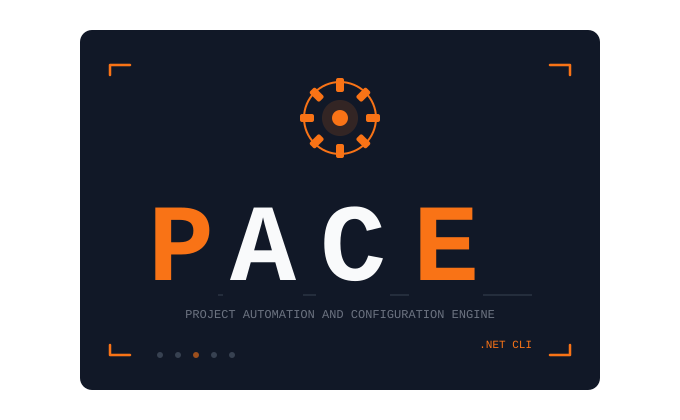
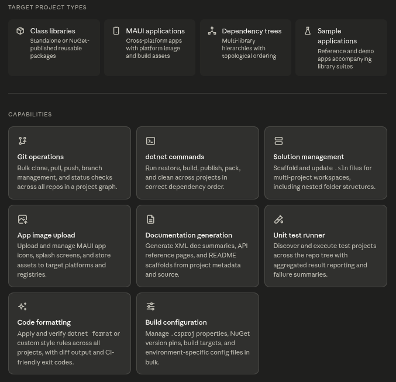

# **P**roject **A**utomation and **C**onfiguration **E**ngine

> A Python CLI tool for bulk management of C# .NET project ecosystems — from single class libraries to complex multi-project hierarchies with MAUI applications.

[](https://python.org)
[](https://dotnet.microsoft.com)
[](https://dotnet.microsoft.com/apps/maui)
[](./LICENSE)

---

## Overview

PACE eliminates the repetitive, error-prone manual work of managing .NET project ecosystems at scale. Rather than shelling into each project directory to run `dotnet` commands, manage git state, or manually update build configurations, PACE provides a unified interface to interact with all of them at once.

It understands your project topology — respecting dependency order, project hierarchy, and configuration context — so you can express intent once and apply it across your entire repository graph.

PACE is built for .NET library authors, platform teams, and SDK maintainers who manage production-grade codebases consisting of multiple interconnected components and need reliable, scriptable tooling to keep them in sync.

---

## Target project types

| Type | Description |
|------|-------------|
| **Class libraries** | Standalone or NuGet-published reusable packages |
| **MAUI applications** | Cross-platform apps with platform image and build assets |
| **Dependency trees** | Multi-library hierarchies with topological dependency ordering |
| **Sample applications** | Reference and demo apps accompanying library suites |

---

## Capabilities



---

## Design principles

**Composability** — individual commands can be piped, scripted, and combined into workflows. PACE is a good Unix citizen.

**Topology-awareness** — multi-project operations always respect inter-project dependencies. `CoreLib` is built before `ExtensionLib` before `SampleApp`, automatically.

**Transparency** — every operation emits clear, structured output suitable for both human review and CI log parsing. Nothing happens silently.

**Reproducibility** — configuration is declared in a manifest file that describes the project graph, repository layout, and per-project overrides. Behaviour is version-controllable alongside the code it manages.

---

## Installation

```bash
TBD
```

Or install from source:

```bash
git clone https://github.com/Noremac11800/PACE.git
cd PACE
pip install -e .
```

---

## Quick start

Initialize a manifest in your workspace root:

```bash
pace init
```

This generates a `pace.toml` describing your project graph. Edit it to reflect your repository layout, then run any command across the full graph:

```bash
# Build all projects in dependency order
pace dotnet build

# Build projects starting from a specific project
pace --from ProjectName dotnet build

# Check git status across every repo
pace git status

# Run all unit tests and show a summary
pace test

# Format and verify code style
pace format --check
```

---

## Configuration

PACE is driven by a `pace.toml` manifest at your workspace root:

```toml
[workspace]
path = "C:\Applications\Melbourne"

[[project]]
name = "toolkit-maui-core"
path = "./toolkit-maui-core/src/Toolkit.Maui.Core/Toolkit.Maui.Core.csproj"
type = "classlib"

[[project]]
name = "appmodule-core"
path = "./appmodule-core/src/AppModule.Core/AppModule.Core.csproj"
type = "classlib"
depends_on = ["toolkit-maui-core"]

[[project]]
name = "Survey123-Mobile"
path = "./Survey123-Mobile/src/Survey123.MobileApp/Survey123.MobileApp.csproj"
type = "maui"
depends_on = ["appmodule-core"]
```

---

## Development

```bash
# Install in development mode
pip install -e ".[dev]"

# Run tests
pytest

# Format code
ruff format .

# Check code style
ruff check .

# or for safe fixes
ruff check --fix .

# Type check
pyright
```

## License

[MIT](./LICENSE)
